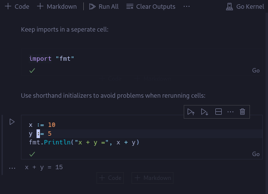
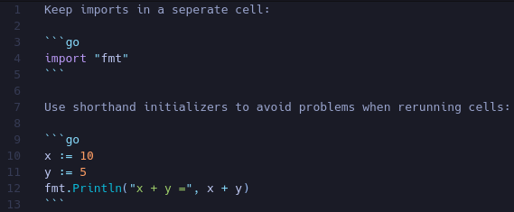
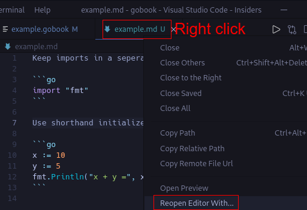

# Gobook: Go Notebook VS Code Extension

## Warning!
This extension currently only works on VS Code Insiders as it's reliant on a fix:
[Issue 121456](https://github.com/microsoft/vscode/issues/121456). Expect it to be stable for the July release.

## Install Instructions
- Install the extension
- Extension will automatically start when opening a .gobook file
- To use it with a .md or .markdown file, right click on the file and press 'Open With' then 'Gobook'


## Usage Instructions

Make sure to use shorthand initializers and keep your imports in seperate cells:



Files will save with standard markdown code blocks e.g.



You can save your .gobook files as .md files and they'll behave like markdown e.g. they'll render on Github with syntax highlighting.

Alternatively you can run go code directly in a .md or .markdown file:




Use the command pallette to restart kernel
```markdown
ctrl+shift+p
Go Notebook Kernel: Restart Kernel
```

As the notebook is using the new Notebook API, there are many keyboard shortcuts available in File > Preferences > Keyboard Shortcuts. Type in 'Notebook:' to see everything available.

## Kernel
The kernel being used originated from [Go Notebook Kernel](https://marketplace.visualstudio.com/items?itemName=ethan-reesor.go-notebook-kernel) by Ethan Reesor, which uses [Yaegi](https://github.com/traefik/yaegi) under the hood.

All credit to Ethan Reesor.

Originally was using it as a dependency but needed to merge it into this project to allow for changes to make it work with .gobook files and allow local debugging.


## Development Status
### Working
- Add an option to activate extension with .md or .gobook files
- Activate extension as default when opening a .gobook file
- Syntax highlighting
- Save output of cells to file
- Reload output when reopening file

### In Development 
- Make an icon for .gobook files
- Code completion / linting
- Auto format cells
- Variables explorer
- Export to PDF
