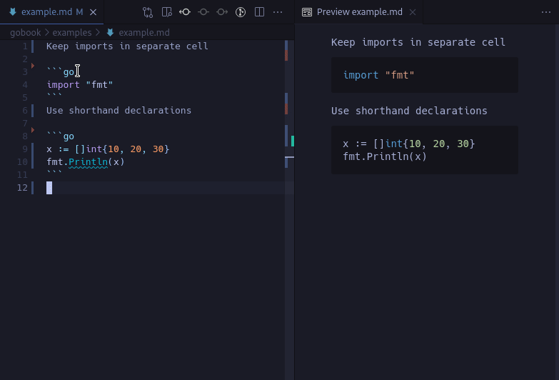

# Gobook: Go Notebook VS Code Extension

## Warning!
This extension currently only works on VS Code Insiders as it's reliant on a fix:
[Issue 121456](https://github.com/microsoft/vscode/issues/121456). Expect it to be stable for the July release.

## Install Instructions
- Install the extension
- Extension will automatically start when opening a .gobook file
- To use it with a .md or .markdown file, right click on the file and press 'Open With' then 'Gobook'


## Usage Instructions

Make sure to use shorthand initializers and keep your imports in separate cells.

Here is an example showing the source code in markdown format, and changing between a normal text editor and the Gobook editor while retaining outputs:




Use the command pallette to restart kernel
```markdown
ctrl+shift+p
Go Notebook Kernel: Restart Kernel
```

As the notebook is using the new Notebook API, there are many keyboard shortcuts available in File > Preferences > Keyboard Shortcuts. Type in 'Notebook:' to see everything available.

## Kernel
The kernel being used originated from [Go Notebook Kernel](https://marketplace.visualstudio.com/items?itemName=ethan-reesor.go-notebook-kernel) by Ethan Reesor, which uses [Yaegi](https://github.com/traefik/yaegi) under the hood.

All credit to Ethan Reesor.

Originally was using it as a dependency but ultimately merged it into this project for ease of development and local debugging.

## Development Status
### Working
- Add an option to activate extension with .md or .gobook files
- Activate extension as default when opening a .gobook file
- Syntax highlighting
- Save output of cells to file
- Reload output when reopening file
- Markdown formatting to represent code in and code out 

### In Development 
- Code completion / linting
- Auto format cells
- Variables explorer by saving state
- Rewrite Go kernel removing protocol buffers to make extension more lightweight
- Export to PDF

### Future development
- Add support to execute JS, TS and Python code cells with additional kernels
- Shared state between all languages, i.e. initialize x in Python and use it in Go
- API for adding any language 

## Known Issues
### Being worked on
- Printing in a loop sometimes results in an output being left in the buffer, and printing on the next execution
- var keyword has issues when rerunning cells
- Have to run imports in separate cells
- Rerunning imports not handled gracefully

[If you have any other issues please submit here](https://github.com/gobookdev/gobook/issues)